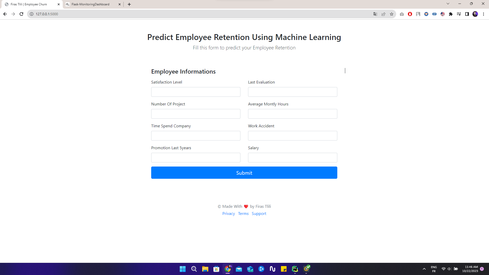

# End To End HR Employee Retention using ML

🚀 Exciting News! 🚀

I'm thrilled to share the remarkable achievements of our latest project, "End To End HR Employee Retention using ML." 🌟

In this comprehensive Machine Learning project, we've embarked on an incredible journey through the entire ML project lifecycle. 🌐



## Achievements

- **Data Collection Pipeline**: We established a robust data collection pipeline, ensuring that we had the right data at the right time.

- **EDA (Exploratory Data Analysis)**: We delved deep into the data, unraveling insights and patterns that formed the foundation of our solution.

- **Data Preprocessing**: We meticulously prepared and cleaned the data, ensuring its quality and readiness for modeling.

- **Model Building**: We created powerful predictive models, leveraging cutting-edge ML techniques to enhance employee retention strategies.

- **Model Evaluation**: Rigorous testing and validation processes were undertaken to ensure the models were performing at their best.

- **REST API Development**: We exposed our trained models as REST APIs, enabling seamless training and predictive capabilities with training and prediction batch datasets.

- **Logger Implementation**: To keep track of our progress, we developed a logging system, capturing valuable insights and data.

- **User Interface**: A user-friendly interface was crafted, simplifying interactions and providing a seamless experience.

- **Flask Backend**: We built a robust backend using Flask, ensuring the performance and scalability of our solution.

Our team's dedication, expertise, and innovation have truly paid off, and we're excited to see the positive impact this project will have on HR employee retention.

Stay tuned for more insights as we share our learnings and experiences from this fantastic project. Feel free to connect and engage with us if you'd like to explore this project further or discuss any ML-related topics. 🤝

#MachineLearning #EmployeeRetention #MLProject #Innovation

## Getting Started

To run this project on your local machine, follow these steps:

### Prerequisites

Ensure you have the required packages and dependencies installed. You can do this using `pip` and the `requirements.txt` file.

```bash
pip install -r Backend/requirements.txt
```

### Running the Flask Server
```bash
python app.py
```

